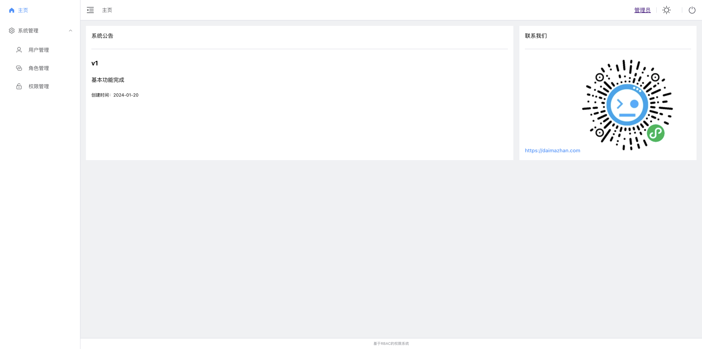
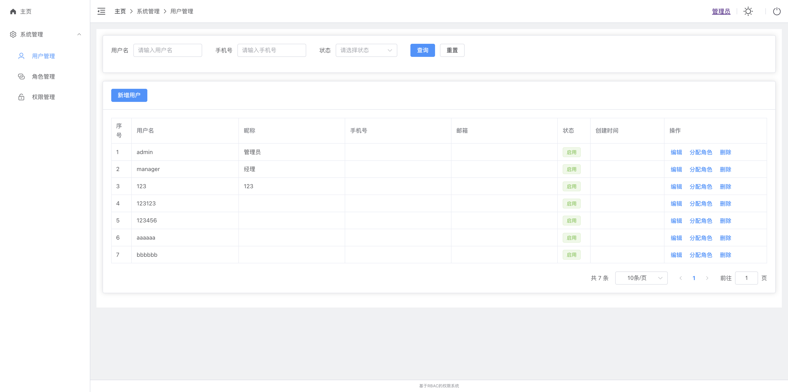
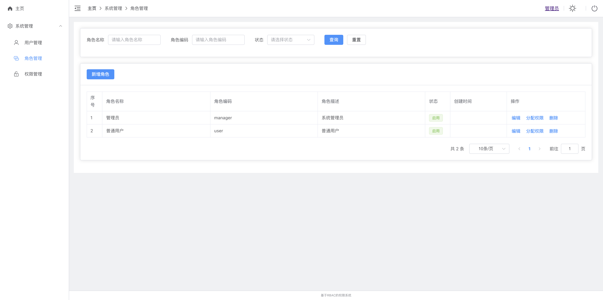
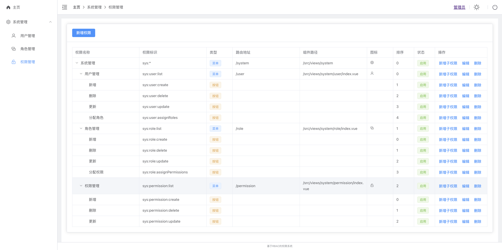
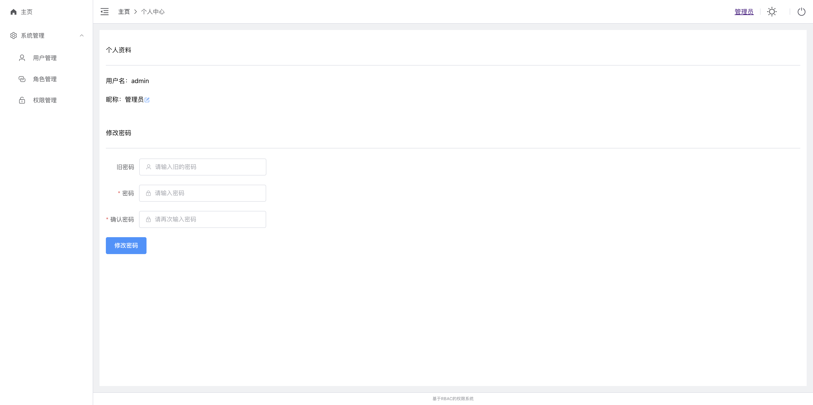

# 权限管理系统

一个基于RBAC的权限管理系统基础框架，适用于毕业设计，Java初学者。

[代码站](https://daimazhan.com) 微信：daimazhan

用户：admin 密码：123123

## 技术栈
JDK 17 , node 18
1. springboot 2.5.15
2. mybatis-plus 3.5.3
3. sa-token v1.34.0
4. vue 3.3.4
5. element-plus 2.3.9
6. vite

## 主要功能
1. 注册登录
2. 用户管理
3. 权限管理
4. 角色管理

## 项目结构
db: 数据库脚本  
src：后端目录  
web：前端目录

## 错误码
'401': '认证失败，无法访问系统资源'。

'403': '当前操作没有权限'。

'404': '访问资源不存在'。

'default': '系统未知错误，请反馈给管理员'。

## 项目预览

